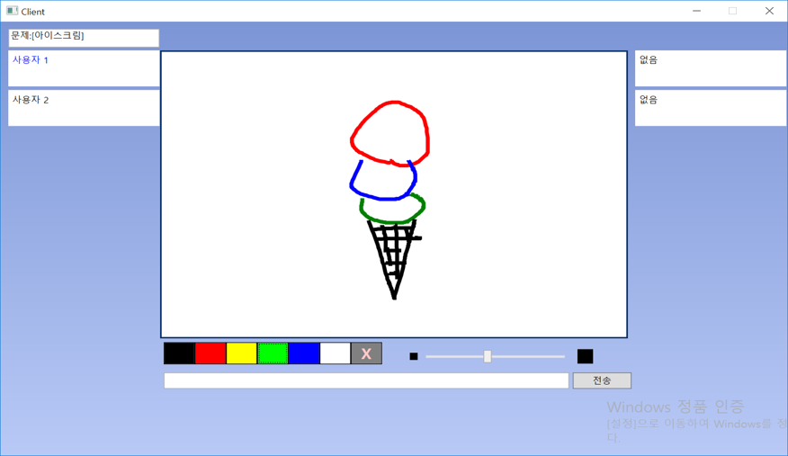

# 17_T05_CatchMind

Casual painting quiz game (client/server). It mimics basic game rule of "CatchMind" game. (http://cmind.netmarble.net) It was team project of 2017 Computer Networking class.

## Environment

* Visual Studio 2017 or higher.
* WPF (Windows presentation foundation)
* Windows 7 or higher.

## How to Use

* Run server application (CM_Server.exe). If you run on discrete PC, you must open 10000 TCP port in firewall.
* Run client application(Client.exe). Fill out IP, port (10000), and click "접속"(connect).
* Look over at least 2 client are connected. Click "문제 출제하기"(open a question) to start game.